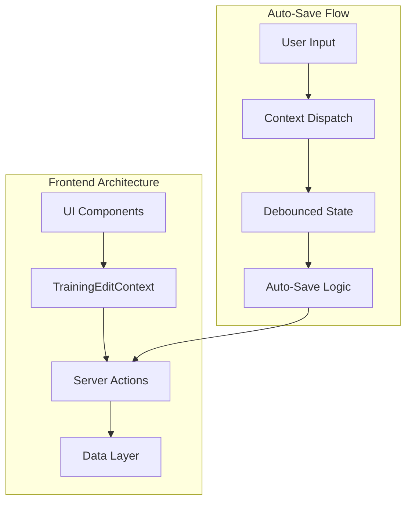
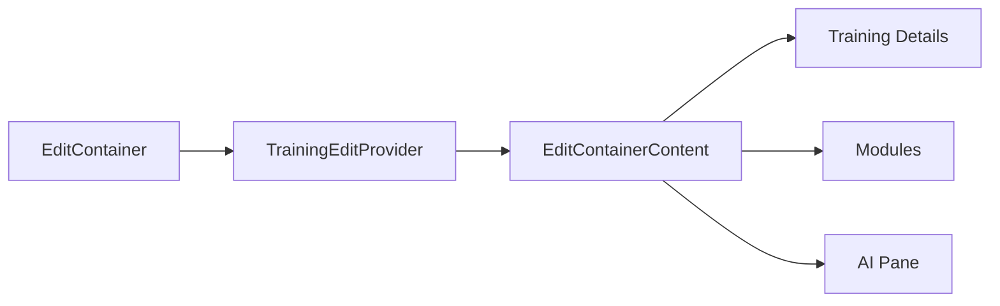
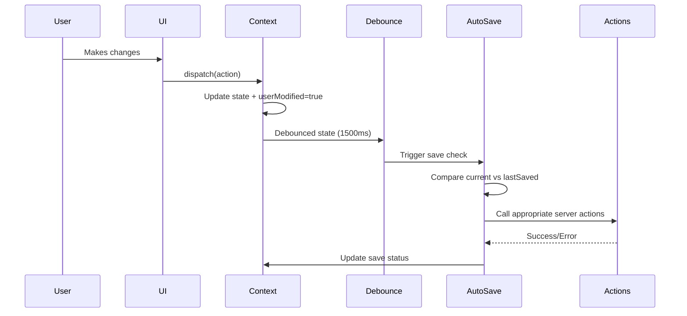
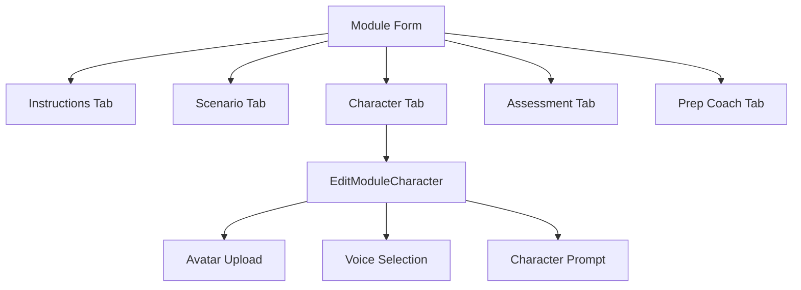
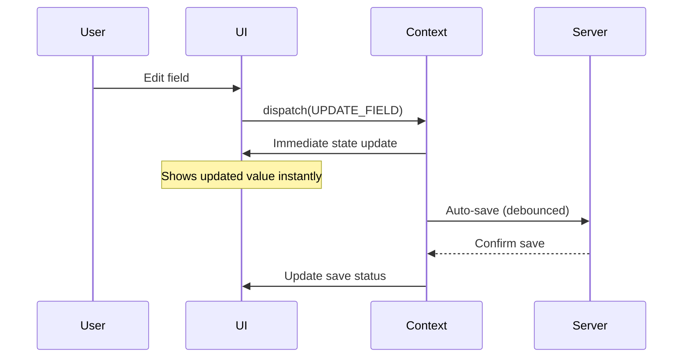
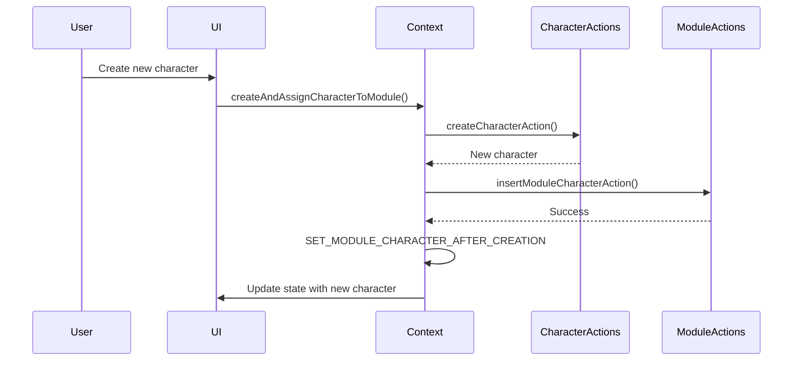

# Training and Module Editing Architecture

This document outlines the architecture and patterns used for editing trainings and modules in the frontend application. The system follows a React Context-based state management pattern with debounced auto-saving and server actions for persistence.

## Overview

The training editing system consists of several layers:

1. **UI Components** - React components for form inputs and user interactions
2. **State Management** - Context-based state with reducer pattern for complex state updates
3. **Auto-Save System** - Debounced persistence with optimistic updates
4. **Server Actions** - Next.js server actions for database operations
5. **Data Layer** - Type-safe database operations with Supabase



## Core Components

### 1. Page Entry Point (`page.tsx`)

The edit page serves as the entry point and data loader:

```typescript
// Key responsibilities:
// - Server-side data fetching
// - Authentication check
// - Initial data hydration
export default async function EditTrainingPage(props: {
  params: Promise<{ trainingId: number }>;
}) {
  const [training, characters] = await Promise.all([
    getTrainingByIdForEditAction(params.trainingId),
    getCharactersAction(user.currentProject.id),
  ]);

  return (
    <EditContainer initialTraining={training} initialCharacters={characters} />
  );
}
```

### 2. Container Component (`edit-container.tsx`)

The container manages the overall editing experience:

- **State Management**: Wraps content with `TrainingEditProvider`
- **UI Layout**: Manages tabs, AI pane, and action buttons
- **Keyboard Shortcuts**: Handles global shortcuts (⌘K for AI pane)
- **Save & Exit Logic**: Orchestrates final save before navigation



### 3. Context Provider (`training-edit-context.tsx`)

The central state management system with several key features:

#### State Structure
```typescript
type TrainingEditState = {
  training: TrainingEdit;
  selectedModuleId: number | undefined;
  availableCharacters: CharacterSummary[];
  saveStatus: "idle" | "saving" | "error" | "saved";
  lastSavedAt: Date | null;
  isSaving: boolean;
  lastSavedState: TrainingEdit | null;
  userModified: boolean;
};
```

#### Action Types
The context supports various action types for different operations:

- **Training Actions**: `UPDATE_TRAINING_FIELD`
- **Module List Actions**: `ADD_MODULE_SUCCESS`, `DELETE_MODULE`, `REORDER_MODULES`
- **Module Selection**: `SELECT_MODULE`
- **Module Detail Actions**: `UPDATE_MODULE_FIELD`, `UPDATE_MODULE_PROMPT_FIELD`
- **Character Actions**: `SELECT_MODULE_CHARACTER`, `UPDATE_MODULE_CHARACTER_PROMPT`, etc.

#### Auto-Save System

The context implements a sophisticated auto-save system:



Key auto-save features:
- **1500ms debounce** to avoid excessive API calls
- **Differential saving** - only saves changed fields
- **Optimistic updates** for immediate UI feedback
- **Error handling** with user notification
- **Save status tracking** with visual indicators

## Form Components

### 4. Training Form (`edit-training-form.tsx`)

Handles training-level fields:
- Title, tagline, description
- Image upload with storage integration
- Preview URL for video content

### 5. Modules Management (`edit-modules.tsx`)

Manages the module list and selection:
- Module list with drag-and-drop reordering
- Add/delete module operations
- Module selection with URL synchronization
- Keyboard shortcuts (Alt+B for collapse)

### 6. Module Form (`edit-module-form.tsx`)

Tabbed interface for module editing:
- **Instructions Tab**: User-facing instructions
- **Scenario Tab**: AI scenario prompt
- **Character Tab**: Character assignment and configuration
- **Assessment Tab**: AI assessment prompt
- **Prep Coach Tab**: Pre-session coaching prompt

### 7. Character Management (`edit-module-character.tsx`)

Character-specific editing:
- Character selection and creation
- Avatar upload and management
- Voice selection
- Character-specific prompts



## Server Actions Layer

### Training Actions (`trainingActions.ts`)
- `getTrainingByIdForEditAction`: Fetch training with full module data
- `updateTrainingAction`: Update training details
- `deleteTrainingAction`: Delete entire training

### Module Actions (`moduleActions.ts`)
- `createModuleAction`: Create new module with default structure
- `updateModuleAction`: Update module and its prompts
- `deleteModuleAction`: Delete module and cleanup

### Character Actions (`character-actions.ts`)
- `createCharacterAction`: Create new character
- `updateCharacterAction`: Update character details
- `createAndAddCharacterAction`: Create and assign to module

### Module-Character Linking (`modules-characters-actions.ts`)
- `insertModuleCharacterAction`: Link character to module
- `updateModuleCharacterPromptAction`: Update character-specific prompt

## Data Flow Patterns

### 1. Optimistic Updates

The system uses optimistic updates for immediate UI feedback:



### 2. Error Recovery

When saves fail:
- State remains in modified state
- User sees error indicator
- Retry mechanism available
- Data not lost during navigation

### 3. Character Creation Flow

Special handling for character creation and assignment:



## Key Patterns and Conventions

### 1. State Management
- **Immutable updates**: All state changes create new objects
- **Action-based updates**: Centralized logic in reducer
- **Type safety**: Strong typing for all actions and state

### 2. Auto-saving
- **Debounced saves**: 1500ms delay to batch changes
- **Differential updates**: Only save changed fields
- **Status tracking**: Visual feedback for save state

### 3. Form Handling
- **Controlled components**: All inputs controlled by context state
- **AI Focus components**: Special inputs that integrate with AI pane
- **Validation**: Client-side validation with server-side enforcement

### 4. Error Handling
- **Graceful degradation**: Continues working when saves fail
- **User feedback**: Toast notifications for errors
- **Retry mechanisms**: Automatic and manual retry options

### 5. Performance Optimizations
- **Debounced auto-save**: Reduces API calls
- **Selective re-renders**: Context optimized to minimize renders
- **Lazy loading**: Components load data as needed

## Integration Points

### AI Pane Integration
The editing system integrates with an AI assistant pane:
- Context-aware suggestions based on current tab/field
- Apply generated content directly to forms
- Keyboard shortcut integration (⌘K)

### Storage Integration
- Image uploads handled through storage actions
- Automatic cleanup of unused assets
- CDN integration for optimized delivery

### Cache Management
- Next.js cache invalidation after updates
- Optimistic updates for immediate feedback
- Background revalidation for consistency

This architecture provides a robust, user-friendly editing experience with automatic data persistence, real-time collaboration capabilities, and seamless AI integration.